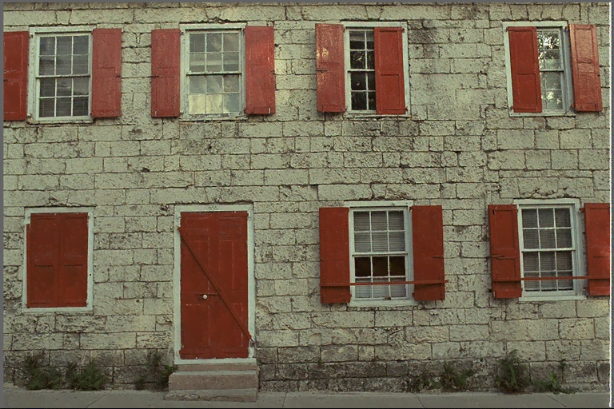
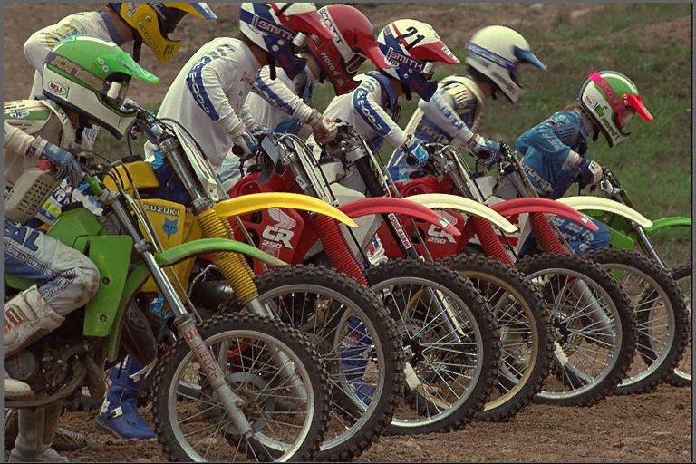

# [XPNG](https://github.com/ImageProcessing-ElectronicPublications/xpng) demo

Program to lossily compress PNG images using adaptive quantization.

## Images

| Origin | XPNG (default) |
| --- | --- |
|  |  |
| 594208 | 142997 |
|  |  |
| 704290 | 194452 |
|  |  |
| 790968 | 207541 |
|  |  |
| 631466 | 160352 |
|  |   |
| 136938 |   |
|  |  |
| 700564 | 181785 |
